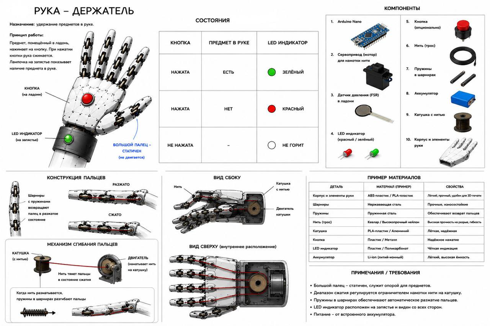

# Роборука

Проект представляет простой сервер для проверки статуса кнопки роборуки-держателя. Статус можно переключать через адресную строку браузера: `ON` или `OFF`.



## Описание роборуки

Рука-держатель предназначена для удержания предмета в ладони. На ладони находится кнопка. Когда предмет попадает в руку, он нажимает кнопку, и рука переходит в активное состояние.

В конструкции четыре подвижных пальца и один неподвижный большой палец. Подвижные пальцы сгибаются за счет нити, которая наматывается на катушку. При ослаблении нити пружины в шарнирах возвращают пальцы в исходное положение.

## Что делает сервер

Сервер хранит один статус кнопки:

- `ON` - кнопка нажата;
- `OFF` - кнопка не нажата.

Статус меняется через URL-команды. Отдельный JavaScript-файл для переключения не нужен, потому что изменение происходит на сервере.

## Как запустить

1. Открыть терминал в папке проекта.
2. Запустить сервер:

```bash
python app.py
```

3. Открыть в браузере:

```text
http://127.0.0.1:8000/
```

Важно: ссылка работает только пока открыт терминал с запущенным `python app.py`.

## Команды

| URL | Действие |
| --- | --- |
| `http://127.0.0.1:8000/` | главная страница |
| `http://127.0.0.1:8000/status` | показать текущий статус |
| `http://127.0.0.1:8000/status_on` | установить статус `ON` |
| `http://127.0.0.1:8000/status_off` | установить статус `OFF` |

Дополнительно работают `/button_on`, `/button_off`, `/knopka_on`, `/knopka_off`.

## Файлы проекта

| Файл | Назначение |
| --- | --- |
| `app.py` | сервер и логика статуса |
| `styles.css` | оформление страницы |
| `README.md` | описание проекта |
| `Эскиз.jpg` | эскиз роборуки |
